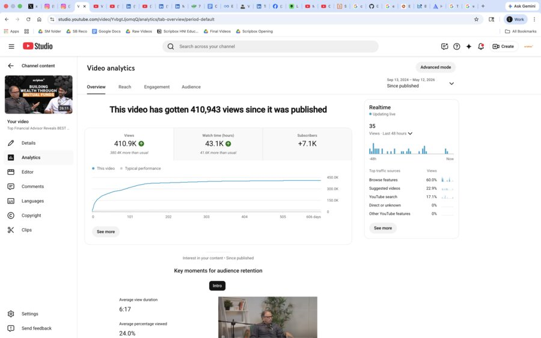

# Tanya Singh — Portfolio

Personal portfolio site. Static HTML + CSS + JS, no build step.

## Local preview

Open `index.html` directly in your browser, or run a tiny local server from this folder:

```bash
python3 -m http.server 8000
```

Then visit http://localhost:8000

## Deploy to GitHub Pages (the fast way)

1. **Create a new GitHub repo.** Recommended name: `portfolio` (any name works). Keep it Public.
2. **Upload everything in this folder** to the repo — `index.html`, all the `.jpg` files, this README. Either drag-and-drop in the GitHub web UI, or push from the command line:

   ```bash
   cd /path/to/this/folder
   git init
   git add .
   git commit -m "Portfolio v1"
   git branch -M main
   git remote add origin https://github.com/<your-username>/portfolio.git
   git push -u origin main
   ```

3. **Turn on GitHub Pages.** In your repo go to **Settings → Pages**. Under "Build and deployment", set Source to **Deploy from a branch**, branch **main**, folder **/ (root)**, then **Save**.
4. Wait ~1 minute. Your site goes live at `https://<your-username>.github.io/portfolio/`.

Add that URL to your resume header and your LinkedIn featured section.

## Update / re-deploy

Just edit any file and push again (or upload the new file via GitHub web UI). The site rebuilds automatically.

## Adding clickable video links to the case studies

Every screenshot is wrapped in an `` tag. To make a screenshot clickable so it opens the original YouTube video / LinkedIn post / Instagram Reel in a new tab, wrap the `` in an `<a href="..." target="_blank">`:

```html
<!-- Before -->
<div class="ss-frame">
  <span class="tp"></span>
  
  <span class="cap">overview · 410.9K views</span>
</div>

<!-- After (clickable) -->
<div class="ss-frame">
  <span class="tp"></span>
  <a href="https://www.youtube.com/watch?v=YOUR_VIDEO_ID" target="_blank" rel="noopener">
    
  </a>
  <span class="cap">overview · 410.9K views</span>
</div>
```

`target="_blank"` opens the link in a new tab. `rel="noopener"` is a small security hardening — keep it.

You can do this for every screenshot:
- Podcast / Shorts → YouTube video URL
- LinkedIn screenshots → LinkedIn post URL
- Instagram Reels → Instagram post URL (or embed link)
- WhatsApp screenshots → your channel invite link

This works perfectly on GitHub Pages — no special config needed.

## File map

| File | What it is |
|------|------------|
| `index.html` | The portfolio itself |
| `tanya_photo.jpg` | Hero headshot |
| `yt_videos_channel.jpg`, `yt_shorts_channel.jpg`, `yt_audience_channel.jpg` | YouTube channel-level stats |
| `podcast_4l_*.jpg`, `podcast_34l_*.jpg`, `podcast_15l_*.jpg`, `podcast_14l_*.jpg` | Podcast episode analytics |
| `short_286k.jpg`, `short_263k.jpg`, `short_259k.jpg`, `short_84k.jpg` | Top Shorts analytics |
| `linkedin_4756.jpg`, `linkedin_4694.jpg`, `linkedin_3581.jpg`, `linkedin_3251.jpg`, `linkedin_1119.jpg`, `linkedin_858.jpg` | LinkedIn post performance |
| `ig_reel_0693.jpg`, `ig_reel_0698.jpg`, `ig_reel_0700.jpg` | Instagram Reel insights |
| `wa_0706.jpg` … `wa_0710.jpg` | WhatsApp channel screenshots |
| `rubberking_germany.jpg`, `rubberking_us.jpg`, `rubberking_flyer.jpg` | Rubber King internship visuals |
| `portfolio.html` | Backup copy of `index.html` — safe to delete |

— Tanya
